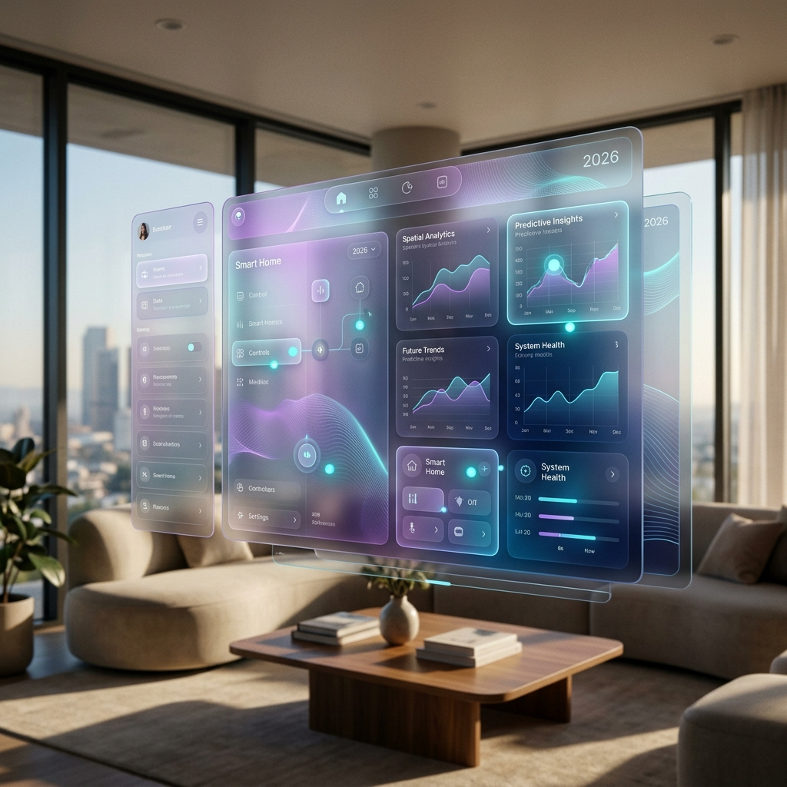

# 🌌 Part 8: Spatial Design & Predictive UX



By May 2026, Product Design has moved beyond flat screens. The rise of AR glasses (Meta Orion) and Spatial Computing (Apple Vision Pro 3) requires a new set of principles.

## 👓 1. Designing for the Z-Axis (Spatial UI)
Spatial design is about depth, gaze, and physics.

- **Gaze-First Interaction:** Buttons shouldn't just be clickable; they should react to eye-focus before the hand even moves.
- **Glassmorphism 2.0:** Use depth-aware materials that adapt to the ambient light of the user's physical environment.
- **Orchestrating Environments:** You aren't designing a page; you're designing an *experience* that might span a user's entire living room.

### 🛠️ Spatial Design Checklist:
- [ ] **Comfort Zones:** Is the UI placed within the natural field of view (60 degrees)?
- [ ] **Depth Anchoring:** Are persistent elements anchored to the user or to physical objects?
- [ ] **Haptic Feedback:** Does the AI-generated interface provide audio/spatial cues for interactions?

---

## 🔮 2. Predictive UX (No-UI)
The most advanced UI in 2026 is the one that *isn't there*.

Predictive UX uses real-time user data and AI agents to anticipate actions.

- **Dynamic Workflows:** The UI morphs based on the user's current intent (detected via gaze, recent actions, and biometric sensors).
- **Just-in-Time Components:** Components are generated on-the-fly via **v0.dev** or **Antigravity** and only appear when needed.
- **Agentic Defaults:** The system performs routine tasks (e.g., filing expenses, scheduling meetings) and only asks for confirmation via a subtle "Confirm" nudge.

### 📝 Example: The "Smart Handoff" Component
If a user is looking at a design file and says "I need to review this with the team," the system should instantly:
1. Generate a "Review Summary" card.
2. Draft a Slack/Discord message.
3. Open a huddle with the relevant stakeholders based on the project context.

---

## 🛠️ Orchestration Rule for Agents
When designing for Spatial/Predictive UX, provide your agents with the **Environment Context**:
```markdown
### 🏠 Environment Context
- **Primary Device:** AR Glasses (Meta Orion)
- **Ambient Light:** High (Outdoor)
- **User Activity:** Walking / On-the-go
- **Interaction Mode:** Gaze + Voice
```
