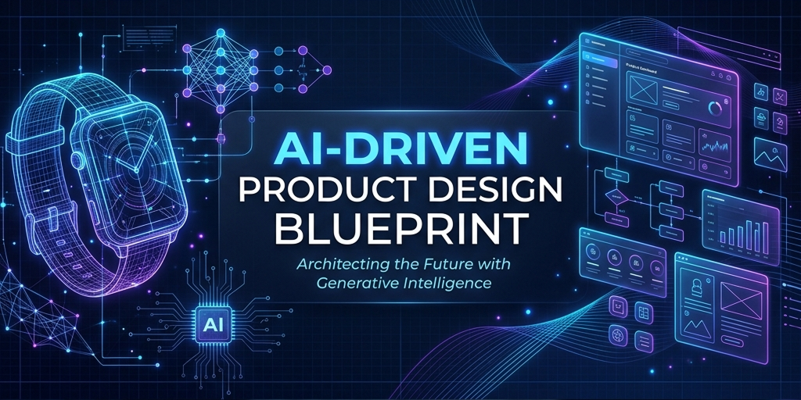

# 🚀 AI-Driven Product Design Blueprint

 

> **The ultimate single source of truth for Product Designers aiming to leverage Agentic AI, Generative UI, and Context Engineering in their daily workflows.**

---

## 🧭 Navigation / Quick Links

Welcome to the future of product design. Choose a category below to dive into the specific workflows, tools, and rules that define the 2026 designer landscape.

| 📚 Category | 📝 Description | 🔗 Link |
|:---|:---|:---|
| **01. Fundamentals** | Core concepts, tools landscape, and context engineering. | [View Section](#-01-fundamentals) |
| **02. Workflows** | Interactive prototyping, spatial design, and research. | [View Section](#-02-workflows) |
| **03. Daily Operations** | Checklists to maximize your AI leverage every day. | [View Section](#-03-daily-operations) |
| **04. Skills & Agents** | Building and orchestrating reusable AI agents. | [View Section](#-04-skills--agents) |
| **05. Rules & Context** | Master context templates and system rules. | [View Section](#-05-rules--context) |
| **06. Process Improvement**| Zero-handoff workflows and AI critiques. | [View Section](#-06-process-improvement) |

---

## 📂 Repository Directory

### 🧠 01. Fundamentals
*The foundational layer of the 2026 AI product design stack.*
* 📄 [**01_Tools_2026.md**](01_Fundamentals/01_Tools_2026.md) — The definitive guide to the current AI stack (Gemini 3.5, Antigravity, Figma AI).
* 📄 [**02_Core_Focus.md**](01_Fundamentals/02_Core_Focus.md) — Transitioning from Prompting to *Context Engineering* with templates.

### ⚡ 02. Workflows
*Advanced strategies for automating the heavy lifting.*
* 📄 [**04_Interactive_Prototyping.md**](02_Workflows/04_Interactive_Prototyping.md) — Transitioning from static screens to functional AI-generated components.
* 📄 [**05_Research_and_Synthesis.md**](02_Workflows/05_Research_and_Synthesis.md) — Synthetic user testing protocols and automated discovery.
* 📄 [**07_Ethics_and_Accessibility.md**](02_Workflows/07_Ethics_and_Accessibility.md) — Navigating AI bias and automating WCAG 3.0 compliance.
* 📄 [**08_Spatial_and_Predictive_UX.md**](02_Workflows/08_Spatial_and_Predictive_UX.md) — **[NEW]** Principles for AR/Spatial UI and "No-UI" predictive interfaces.

### ✅ 03. Daily Operations
*Tactical checklists for your daily grind.*
* 📄 [**06_Daily_Checklist.md**](03_Daily_Operations/06_Daily_Checklist.md) — The 4-stage daily routine for the AI-augmented designer.

### 🤖 04. Skills & Agents
*Moving from user to creator of AI tools.*
* 📄 [**03_Mastering_Skills.md**](04_Skills_and_Agents/03_Mastering_Skills.md) — How to package workflows into reusable AI Agents.
* 📄 [**Visual_Style_Agent.md**](04_Skills_and_Agents/Examples/Visual_Style_Agent.md) — **[NEW]** Example of a Visual Style Guardian Skill.
* 📄 [**Predictive_UX_Auditor.md**](04_Skills_and_Agents/Examples/Predictive_UX_Auditor.md) — **[NEW]** Example of a Predictive UX Auditor Skill.
* 📄 [**UX_Writer_Skill.md**](04_Skills_and_Agents/Examples/UX_Writer_Skill.md) — Example of a UX Writer Agent Skill.
* 📄 [**WCAG_Auditor_Skill.md**](04_Skills_and_Agents/Examples/WCAG_Auditor_Skill.md) — Example of an Accessibility Auditor Skill.

### 📜 05. Rules & Context
*The data you feed to your agents.*
* 📄 [**Master_Context_Template.json**](05_Rules_and_Context/Master_Context_Template.json) — **[NEW]** Comprehensive JSON context stack for an AI agent.
* 📄 [**B2B_SaaS_Rules.md**](05_Rules_and_Context/B2B_SaaS_Rules.md) — Context rules example for enterprise software.
* 📄 [**Design_System_Context.json**](05_Rules_and_Context/Design_System_Context.json) — Legacy JSON context example.

### 📈 06. Process Improvement
*Optimizing the meta-workflow.*
* 📄 [**AI_Design_Review_Template.md**](06_Process_Improvement/AI_Design_Review_Template.md) — Framework for AI-assisted design critiques.
* 📄 [**Handoff_Automation_Guide.md**](06_Process_Improvement/Handoff_Automation_Guide.md) — The "Antigravity Bridge" workflow for zero-handoff.

---

> [!IMPORTANT]
> **Golden Rule for 2026:** Design systems, not just screens. Orchestrate agents, don't just prompt them. Your empathy and strategic vision are the only irreplaceable assets.
